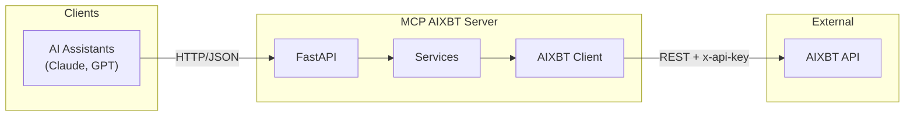

# MCP AIXBT Server

> **Version 0.5** - This server is lightly tested but working. Use at your own risk.

A Model Context Protocol (MCP) server that wraps the AIXBT cryptocurrency intelligence API, enabling AI assistants to access real-time crypto market insights.

## Architecture

See [docs/architecture.md](docs/architecture.md) for detailed architecture diagrams.



## Overview

MCP AIXBT Server acts as a bridge between the AIXBT API and MCP-compatible AI clients (like Claude). It provides:

- **Resources** - Read-only data endpoints for projects, signals, clusters, and chains
- **Tools** - Executable actions including Indigo AI chat and filtered queries
- **x402 Support** - Pay-per-request endpoints using the x402 payment protocol

## Requirements

- Python 3.11+
- AIXBT API Key ([obtain here](https://aixbt.tech/settings/api-keys))
- (Optional) EVM wallet with USDC on Base for x402 endpoints

## Installation

### From Source

```bash
# Clone the repository
git clone https://github.com/SAK1337/aixbtmcp.git
cd aixbtmcp

# Create virtual environment
python -m venv venv
source venv/bin/activate  # Linux/Mac
# or
.\venv\Scripts\activate  # Windows

# Install dependencies
pip install -e ".[dev]"
```

### Using Docker

```bash
docker build -t mcp-aixbt .
```

## Configuration

1. Copy the environment template:
```bash
cp .env.example .env
```

2. Edit `.env` and add your AIXBT API key:
```env
AIXBT_API_KEY=your_api_key_here
```

### Configuration Options

| Variable | Required | Default | Description |
|----------|----------|---------|-------------|
| `AIXBT_API_KEY` | Yes | - | AIXBT API key for REST API access |
| `EVM_PRIVATE_KEY` | No | - | EVM private key for x402 payments |
| `HOST` | No | `127.0.0.1` | Server host |
| `PORT` | No | `8000` | Server port |
| `DEBUG` | No | `false` | Enable debug mode |
| `LOG_LEVEL` | No | `INFO` | Logging level (DEBUG, INFO, WARNING, ERROR) |
| `LOG_FORMAT` | No | `json` | Log format (`json` or `text`) |
| `CACHE_TTL_SECONDS` | No | `300` | Cache TTL in seconds |
| `MAX_PRICE_PER_CALL_USDC` | No | `1.0` | Max x402 payment per request |
| `MAX_SPEND_PER_DAY_USDC` | No | `10.0` | Max daily x402 spend |

## Usage

### Start the Server

```bash
# Development mode with auto-reload
uvicorn mcp_aixbt.main:app --reload

# Production mode
uvicorn mcp_aixbt.main:app --host 0.0.0.0 --port 8000
```

### Using Docker Compose

```bash
docker-compose up
```

### API Documentation

Once running, visit:
- Swagger UI: http://localhost:8000/docs
- ReDoc: http://localhost:8000/redoc

## API Endpoints

### Health Checks

| Endpoint | Method | Description |
|----------|--------|-------------|
| `/health` | GET | Basic health check |
| `/health/ready` | GET | Readiness check (validates AIXBT connectivity) |
| `/health/live` | GET | Liveness probe |

### Resources (GET)

| Endpoint | Description |
|----------|-------------|
| `/resources/projects` | List projects with momentum scores |
| `/resources/projects/{id}` | Get project details |
| `/resources/projects/{id}/momentum` | Get momentum history |
| `/resources/signals` | List market signals |
| `/resources/clusters` | List information clusters |
| `/resources/chains` | List supported blockchains |

### Tools (POST)

| Endpoint | Description |
|----------|-------------|
| `/tools/query-indigo` | Chat with AIXBT Indigo agent |
| `/tools/list-projects` | Search projects with filters |
| `/tools/get-signals` | Get filtered signals |
| `/tools/get-surging-projects` | Get surging projects (x402 required) |

## Example Requests

### List Projects

```bash
curl http://localhost:8000/resources/projects?limit=10&sortBy=momentumScore
```

### Query Indigo

```bash
curl -X POST http://localhost:8000/tools/query-indigo \
  -H "Content-Type: application/json" \
  -d '{"message": "What narratives are gaining traction today?"}'
```

### Get Signals by Category

```bash
curl -X POST http://localhost:8000/tools/get-signals \
  -H "Content-Type: application/json" \
  -d '{"categories": "WHALE_ACTIVITY,TECH_EVENT", "limit": 20}'
```

## Development

### Run Tests

```bash
pytest
```

### Type Checking

```bash
mypy src/
```

### Linting

```bash
ruff check src/
```

## Project Structure

```
src/mcp_aixbt/
├── main.py              # FastAPI application entry point
├── config.py            # Configuration management
├── clients/
│   ├── aixbt.py         # AIXBT REST API client
│   └── x402.py          # x402 payment handler
├── models/
│   ├── projects.py      # Domain models (Project, Signal, etc.)
│   ├── requests.py      # Request schemas
│   └── responses.py     # Response schemas
├── routers/
│   ├── health.py        # Health check endpoints
│   ├── resources.py     # MCP Resource endpoints
│   └── tools.py         # MCP Tool endpoints
├── services/
│   ├── projects.py      # Project service layer
│   ├── signals.py       # Signal service layer
│   └── indigo.py        # Indigo chat service
├── middleware/
│   └── logging.py       # Request logging middleware
└── utils/
    ├── cache.py         # TTL cache implementation
    └── errors.py        # Custom exceptions
```

## Known Limitations (v0.5 Alpha)

- [ ] Integration tests pending
- [ ] x402 payment flow not tested with live network
- [ ] Rate limiting is client-side only
- [ ] No persistent caching (in-memory only)
- [ ] WebSocket support not implemented

## Contributing

This project is in alpha. Please report issues and submit PRs for bug fixes.

## License

MIT

## Disclaimer

This is alpha software. The authors are not responsible for any financial losses incurred through the use of this software or the AIXBT API. Always verify data independently before making trading decisions.
