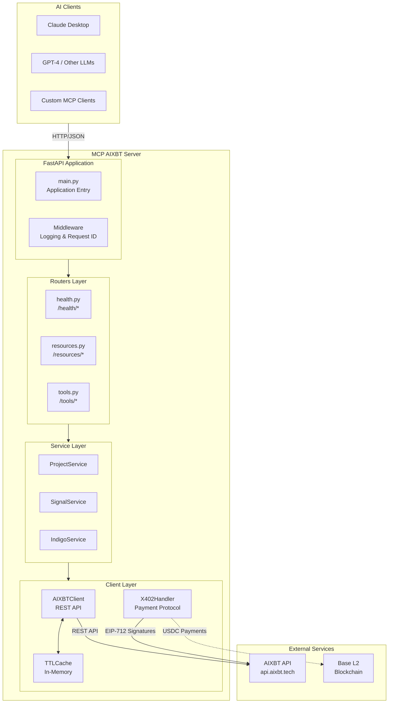
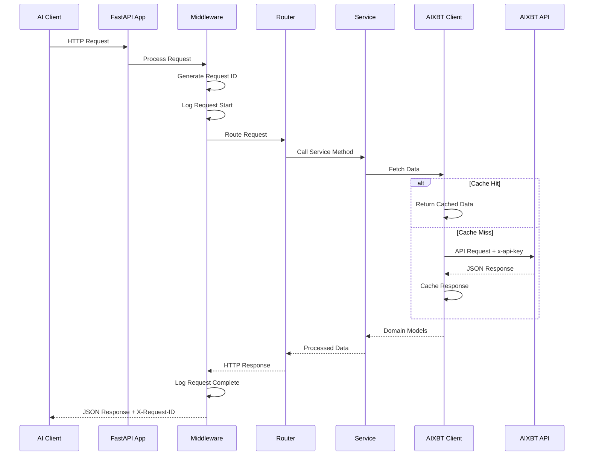
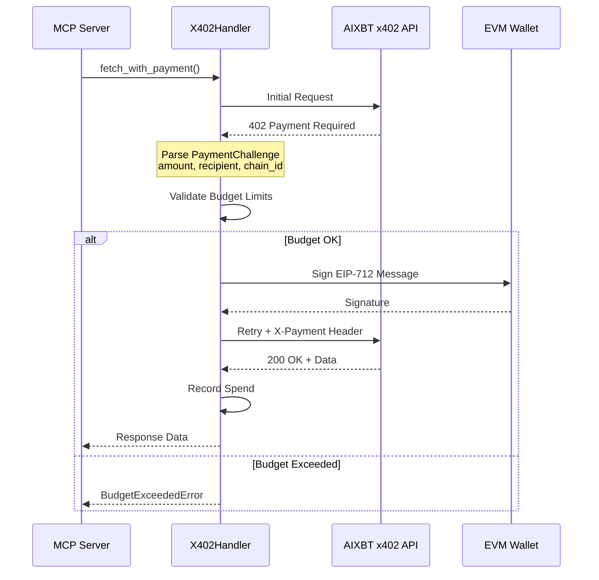
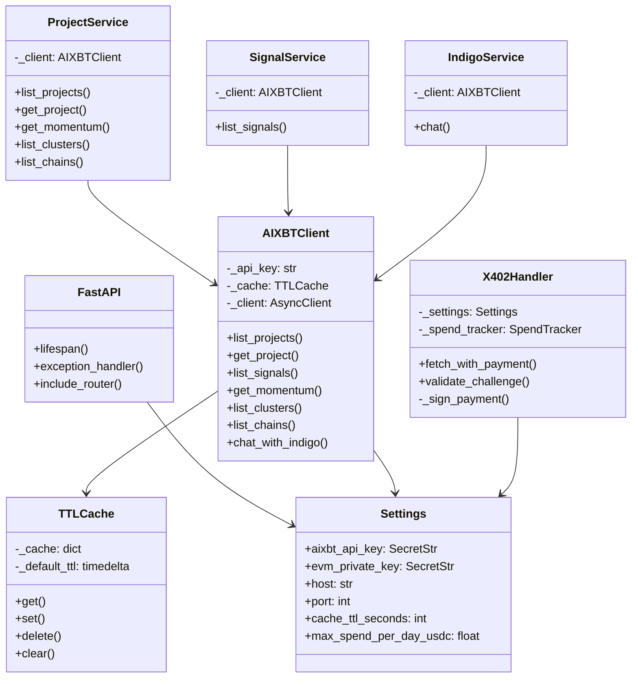
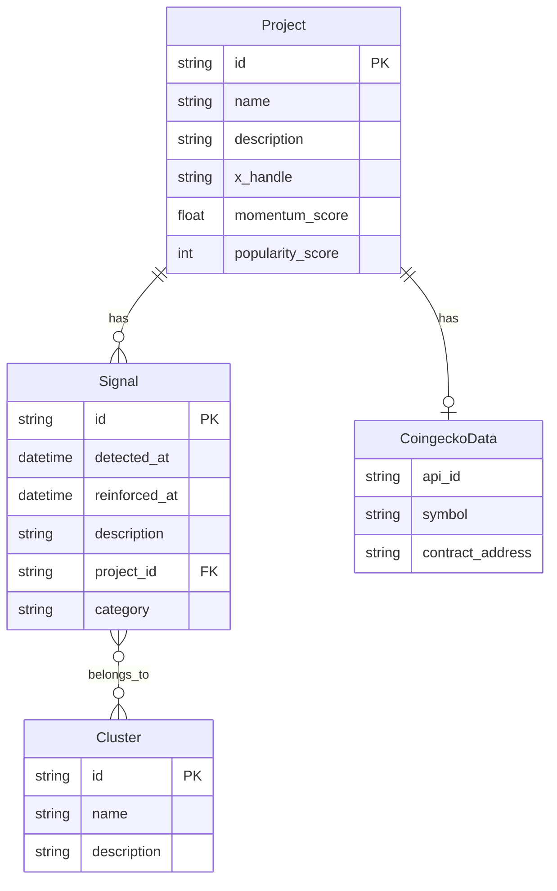
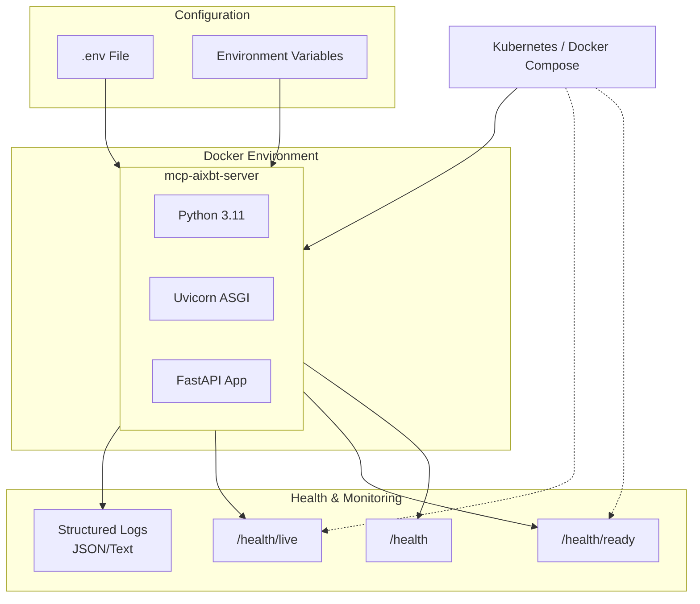
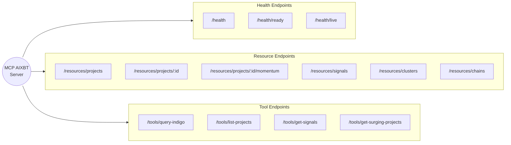

# MCP AIXBT Server Architecture

## System Overview

```mermaid
flowchart TB
    subgraph Clients["AI Clients"]
        Claude["Claude Desktop"]
        GPT["GPT-4 / Other LLMs"]
        Custom["Custom MCP Clients"]
    end

    subgraph MCP["MCP AIXBT Server"]
        direction TB

        subgraph API["FastAPI Application"]
            Main["main.py<br/>Application Entry"]
            MW["Middleware<br/>Logging & Request ID"]
        end

        subgraph Routers["Routers Layer"]
            Health["health.py<br/>/health/*"]
            Resources["resources.py<br/>/resources/*"]
            Tools["tools.py<br/>/tools/*"]
        end

        subgraph Services["Service Layer"]
            ProjectSvc["ProjectService"]
            SignalSvc["SignalService"]
            IndigoSvc["IndigoService"]
        end

        subgraph ClientLayer["Client Layer"]
            AIXBTClient["AIXBTClient<br/>REST API"]
            X402Handler["X402Handler<br/>Payment Protocol"]
            Cache["TTLCache<br/>In-Memory"]
        end
    end

    subgraph External["External Services"]
        AIXBT["AIXBT API<br/>api.aixbt.tech"]
        Base["Base L2<br/>Blockchain"]
    end

    Clients -->|HTTP/JSON| API
    API --> Routers
    Routers --> Services
    Services --> ClientLayer
    AIXBTClient -->|REST API| AIXBT
    X402Handler -->|EIP-712 Signatures| AIXBT
    X402Handler -.->|USDC Payments| Base
    AIXBTClient <--> Cache
```

## Request Flow

```mermaid
sequenceDiagram
    participant Client as AI Client
    participant FastAPI as FastAPI App
    participant MW as Middleware
    participant Router as Router
    participant Service as Service
    participant AIXBT as AIXBT Client
    participant API as AIXBT API

    Client->>FastAPI: HTTP Request
    FastAPI->>MW: Process Request
    MW->>MW: Generate Request ID
    MW->>MW: Log Request Start
    MW->>Router: Route Request
    Router->>Service: Call Service Method
    Service->>AIXBT: Fetch Data

    alt Cache Hit
        AIXBT->>AIXBT: Return Cached Data
    else Cache Miss
        AIXBT->>API: API Request + x-api-key
        API-->>AIXBT: JSON Response
        AIXBT->>AIXBT: Cache Response
    end

    AIXBT-->>Service: Domain Models
    Service-->>Router: Processed Data
    Router-->>MW: HTTP Response
    MW->>MW: Log Request Complete
    MW-->>Client: JSON Response + X-Request-ID
```

## x402 Payment Flow

```mermaid
sequenceDiagram
    participant Client as MCP Server
    participant Handler as X402Handler
    participant API as AIXBT x402 API
    participant Wallet as EVM Wallet

    Client->>Handler: fetch_with_payment()
    Handler->>API: Initial Request
    API-->>Handler: 402 Payment Required

    Note over Handler: Parse PaymentChallenge<br/>amount, recipient, chain_id

    Handler->>Handler: Validate Budget Limits

    alt Budget OK
        Handler->>Wallet: Sign EIP-712 Message
        Wallet-->>Handler: Signature
        Handler->>API: Retry + X-Payment Header
        API-->>Handler: 200 OK + Data
        Handler->>Handler: Record Spend
        Handler-->>Client: Response Data
    else Budget Exceeded
        Handler-->>Client: BudgetExceededError
    end
```

## Component Architecture

```mermaid
classDiagram
    class FastAPI {
        +lifespan()
        +exception_handler()
        +include_router()
    }

    class Settings {
        +aixbt_api_key: SecretStr
        +evm_private_key: SecretStr
        +host: str
        +port: int
        +cache_ttl_seconds: int
        +max_spend_per_day_usdc: float
    }

    class AIXBTClient {
        -_api_key: str
        -_cache: TTLCache
        -_client: AsyncClient
        +list_projects()
        +get_project()
        +list_signals()
        +get_momentum()
        +list_clusters()
        +list_chains()
        +chat_with_indigo()
    }

    class X402Handler {
        -_settings: Settings
        -_spend_tracker: SpendTracker
        +fetch_with_payment()
        +validate_challenge()
        -_sign_payment()
    }

    class TTLCache {
        -_cache: dict
        -_default_ttl: timedelta
        +get()
        +set()
        +delete()
        +clear()
    }

    class ProjectService {
        -_client: AIXBTClient
        +list_projects()
        +get_project()
        +get_momentum()
        +list_clusters()
        +list_chains()
    }

    class SignalService {
        -_client: AIXBTClient
        +list_signals()
    }

    class IndigoService {
        -_client: AIXBTClient
        +chat()
    }

    FastAPI --> Settings
    AIXBTClient --> TTLCache
    AIXBTClient --> Settings
    X402Handler --> Settings
    ProjectService --> AIXBTClient
    SignalService --> AIXBTClient
    IndigoService --> AIXBTClient
```

## Data Models

```mermaid
erDiagram
    Project {
        string id PK
        string name
        string description
        string x_handle
        float momentum_score
        int popularity_score
    }

    Signal {
        string id PK
        datetime detected_at
        datetime reinforced_at
        string description
        string project_id FK
        string category
    }

    Cluster {
        string id PK
        string name
        string description
    }

    CoingeckoData {
        string api_id
        string symbol
        string contract_address
    }

    Project ||--o{ Signal : has
    Project ||--o| CoingeckoData : has
    Signal }o--o{ Cluster : belongs_to
```

## Deployment Architecture

```mermaid
flowchart TB
    subgraph Docker["Docker Environment"]
        subgraph Container["mcp-aixbt-server"]
            Python["Python 3.11"]
            Uvicorn["Uvicorn ASGI"]
            App["FastAPI App"]
        end
    end

    subgraph Config["Configuration"]
        ENV[".env File"]
        Secrets["Environment Variables"]
    end

    subgraph Monitoring["Health & Monitoring"]
        Health["/health"]
        Ready["/health/ready"]
        Live["/health/live"]
        Logs["Structured Logs<br/>JSON/Text"]
    end

    ENV --> Container
    Secrets --> Container
    Container --> Health
    Container --> Ready
    Container --> Live
    Container --> Logs

    K8s["Kubernetes / Docker Compose"] --> Container
    K8s -.-> Ready
    K8s -.-> Live
```

## Endpoint Map

```mermaid
flowchart LR
    subgraph Health["Health Endpoints"]
        H1["/health"]
        H2["/health/ready"]
        H3["/health/live"]
    end

    subgraph Resources["Resource Endpoints"]
        R1["/resources/projects"]
        R2["/resources/projects/:id"]
        R3["/resources/projects/:id/momentum"]
        R4["/resources/signals"]
        R5["/resources/clusters"]
        R6["/resources/chains"]
    end

    subgraph Tools["Tool Endpoints"]
        T1["/tools/query-indigo"]
        T2["/tools/list-projects"]
        T3["/tools/get-signals"]
        T4["/tools/get-surging-projects"]
    end

    API((MCP AIXBT<br/>Server)) --> Health
    API --> Resources
    API --> Tools
```
