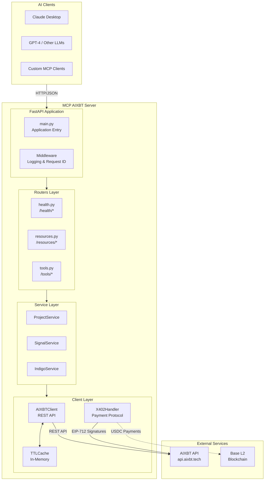
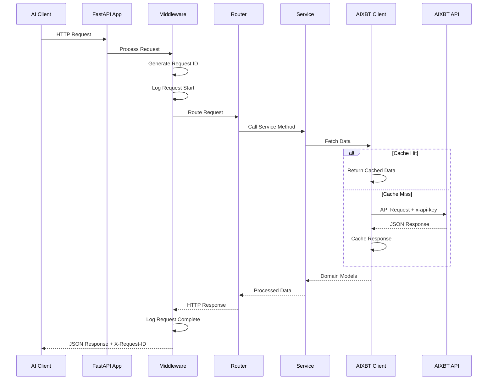
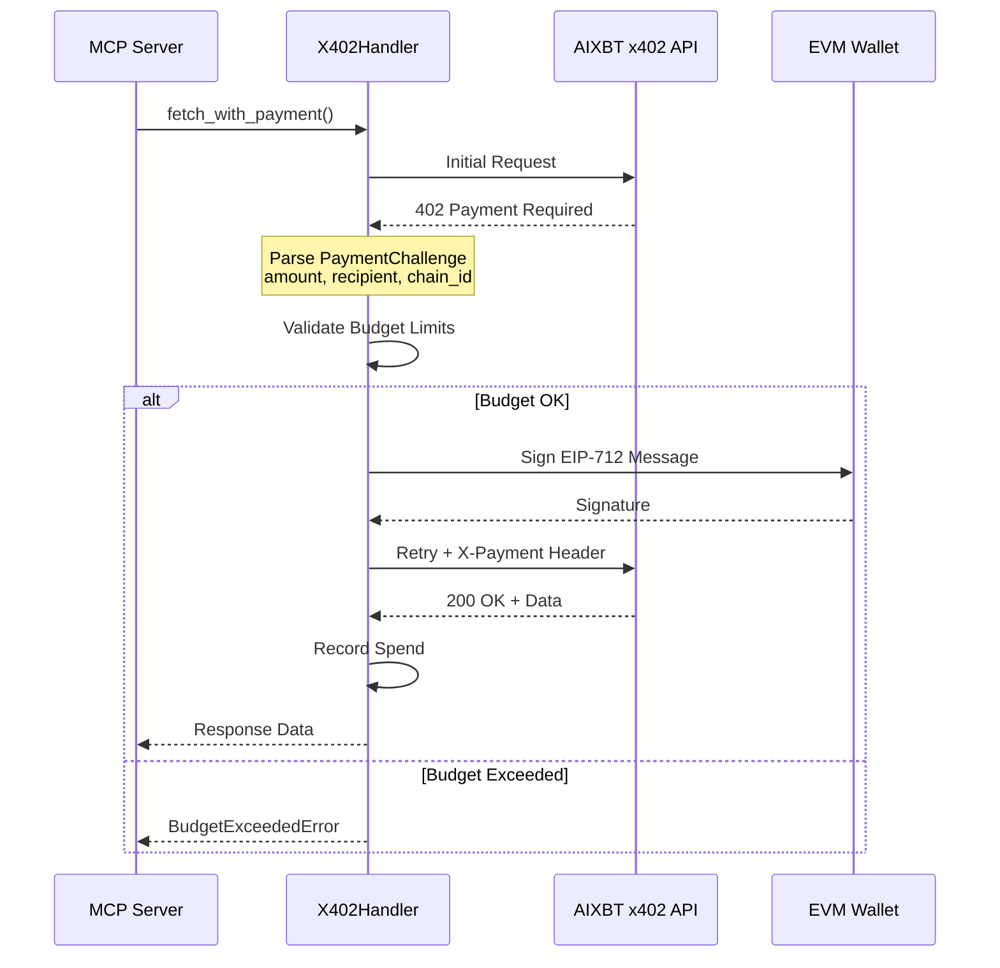
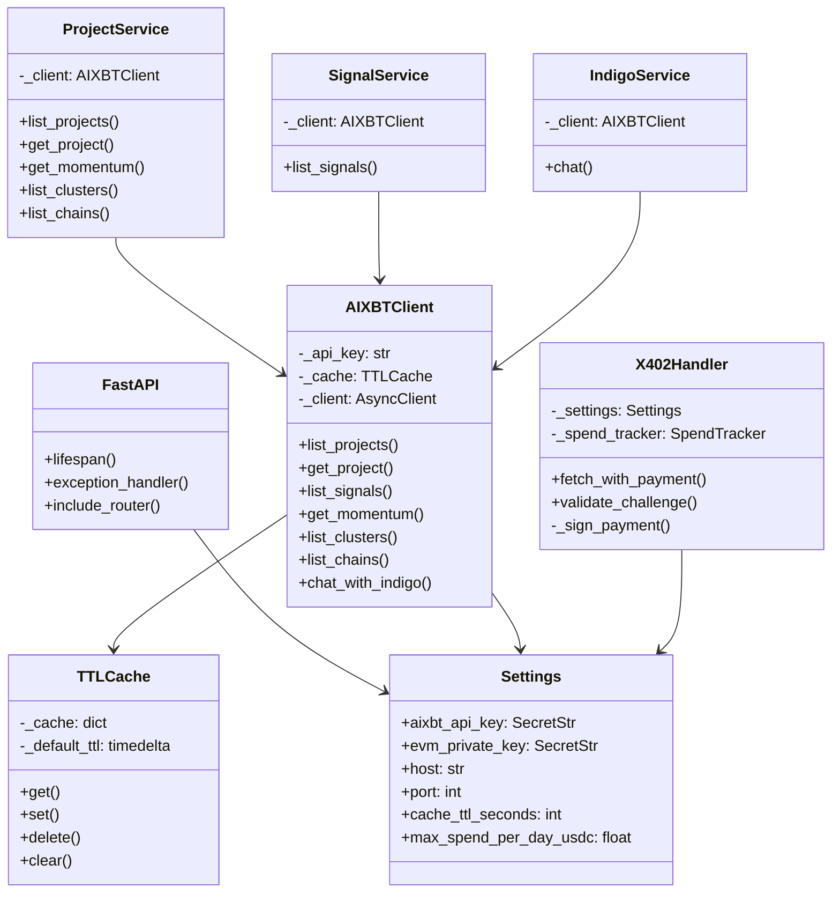
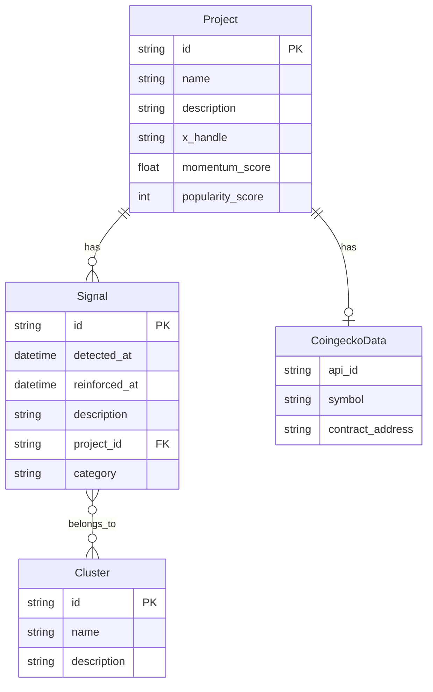
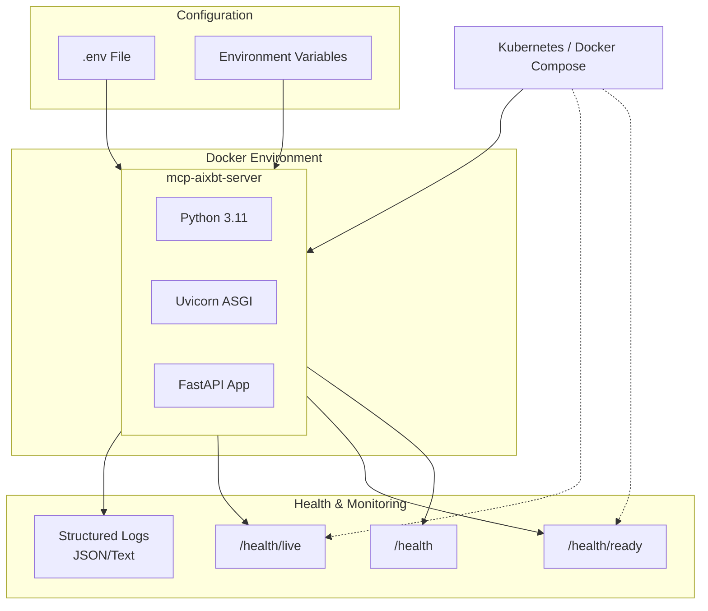
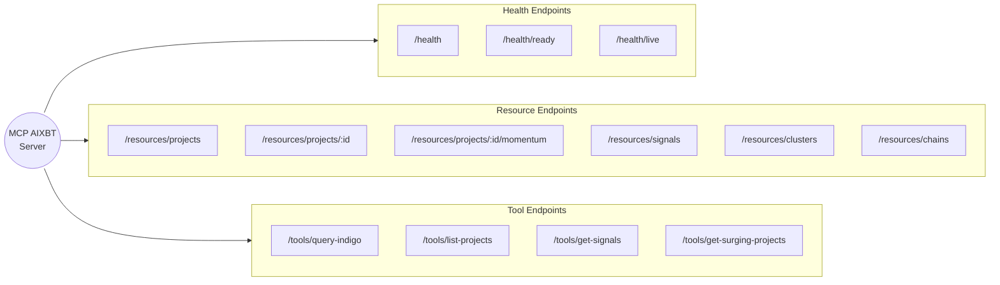

# MCP AIXBT Server Architecture

> **Version:** 0.5.0-alpha
> **Last Updated:** December 2024
> **Status:** In Development

## Table of Contents

1. [Overview](#overview)
2. [System Overview](#system-overview)
3. [Request Flow](#request-flow)
4. [x402 Payment Flow](#x402-payment-flow)
5. [Component Architecture](#component-architecture)
6. [Data Models](#data-models)
7. [Entry Points](#entry-points)
8. [Configuration System](#configuration-system)
9. [Client Layer](#client-layer)
10. [API Endpoints](#api-endpoints)
11. [Services Layer](#services-layer)
12. [Middleware](#middleware)
13. [Utilities](#utilities)
14. [Error Handling](#error-handling)
15. [Caching Strategy](#caching-strategy)
16. [Deployment](#deployment)
17. [Directory Structure](#directory-structure)

---

## Overview

The MCP AIXBT Server is a **Model Context Protocol (MCP)** server that wraps the AIXBT cryptocurrency intelligence API, enabling AI assistants to access real-time crypto market insights, project momentum scores, and market signals.

### Key Features

| Feature | Description |
|---------|-------------|
| **Dual Server Modes** | FastAPI HTTP server and MCP stdio server |
| **Real-time Intelligence** | Access to 37,000+ crypto projects and 300,000+ market signals |
| **x402 Payments** | Support for premium pay-per-request endpoints |
| **Structured Logging** | Request correlation and JSON/text output formats |
| **TTL Caching** | Configurable caching to reduce API calls |
| **Async Architecture** | Full async/await support for high concurrency |

### Tech Stack

| Component | Technology | Version |
|-----------|------------|---------|
| Web Framework | FastAPI | 0.115+ |
| ASGI Server | Uvicorn | 0.34+ |
| HTTP Client | httpx | 0.28+ |
| Data Validation | Pydantic | v2.10+ |
| Configuration | pydantic-settings | 2.7+ |
| Logging | structlog | 24.0+ |
| MCP Protocol | mcp | 1.0+ |
| Blockchain (x402) | eth-account, web3 | 0.13+, 7.0+ |

---

## System Overview



## Request Flow



## x402 Payment Flow



## Component Architecture



## Data Models



## Deployment Architecture



## Endpoint Map



---

## Entry Points

### FastAPI HTTP Server (`main.py`)

The primary entry point for HTTP API access.

**Location:** `src/mcp_aixbt/main.py`

```bash
# Start the server
uvicorn mcp_aixbt.main:app --reload --host 127.0.0.1 --port 8000
```

**Initialization Sequence:**

1. **Lifespan Context Manager**
   - Configures structlog logging
   - Loads settings from environment
   - Prints version info in debug mode

2. **FastAPI Application**
   - Title: "MCP AIXBT Server"
   - Version: Dynamic from `__version__`
   - OpenAPI docs at `/docs` and `/redoc`

3. **Middleware Registration**
   - `RequestLoggingMiddleware` for request/response logging

4. **Router Registration**
   - `/health` - Health check endpoints
   - `/resources` - MCP resource endpoints (GET)
   - `/tools` - MCP tool endpoints (POST)

5. **Exception Handling**
   - Global handler returns JSON error responses

---

### MCP Stdio Server (`mcp_server.py`)

Entry point for Model Context Protocol clients (Claude, etc.).

**Location:** `src/mcp_aixbt/mcp_server.py`

```bash
# Run via entry point
mcp-aixbt-stdio
```

**MCP Tools Exposed:**

| Tool | Description | Parameters |
|------|-------------|------------|
| `list-projects` | Search crypto projects | page, limit, names, tickers, chain, minMomentumScore |
| `get-signals` | Retrieve market signals | page, limit, categories, tickers, names |
| `query-indigo` | Chat with Indigo agent | message (1-10000 chars) |

**MCP Resources:**

| URI Pattern | Type | Description |
|-------------|------|-------------|
| `aixbt://chains` | Static | Supported blockchains |
| `aixbt://clusters` | Static | Information clusters |
| `aixbt://projects/{id}` | Template | Project details |
| `aixbt://projects/{id}/momentum` | Template | Momentum history |

---

## Configuration System

**File:** `src/mcp_aixbt/config.py`

The configuration uses Pydantic v2 `BaseSettings` with automatic environment variable loading.

### Environment Variables

```bash
# =============================================================================
# Required Configuration
# =============================================================================

# AIXBT API Key (obtain from https://aixbt.tech/settings/api-keys)
AIXBT_API_KEY=your_api_key_here

# =============================================================================
# Optional: x402 Pay-Per-Request Configuration
# =============================================================================

# EVM private key for x402 payments (keep secret!)
EVM_PRIVATE_KEY=0x...

# Base chain RPC URL
BASE_RPC_URL=https://mainnet.base.org

# Budget controls
MAX_PRICE_PER_CALL_USDC=1.0
MAX_SPEND_PER_DAY_USDC=10.0

# =============================================================================
# Server Configuration
# =============================================================================

HOST=127.0.0.1
PORT=8000
DEBUG=false

# =============================================================================
# Rate Limiting & Caching
# =============================================================================

RATE_LIMIT_PER_MINUTE=100
RATE_LIMIT_PER_DAY=100000
CACHE_TTL_SECONDS=300  # 5 minutes

# =============================================================================
# Logging
# =============================================================================

LOG_LEVEL=INFO          # DEBUG, INFO, WARNING, ERROR, CRITICAL
LOG_FORMAT=json         # json or text
```

### Settings Class Structure

```python
class Settings(BaseSettings):
    # Required
    aixbt_api_key: SecretStr

    # x402 Payments (optional)
    evm_private_key: SecretStr | None = None
    base_rpc_url: str = "https://mainnet.base.org"
    max_price_per_call_usdc: float = 1.0
    max_spend_per_day_usdc: float = 10.0

    # Server
    host: str = "127.0.0.1"
    port: int = Field(default=8000, ge=1, le=65535)
    debug: bool = False

    # Rate Limiting
    rate_limit_per_minute: int = 100
    rate_limit_per_day: int = 100000

    # Caching
    cache_ttl_seconds: int = 300

    # Logging
    log_level: str = "INFO"
    log_format: str = "json"
```

---

## Client Layer

### AIXBTClient (`clients/aixbt.py`)

The core HTTP client for communicating with the AIXBT REST API.

**Configuration:**
- **Base URL:** `https://api.aixbt.tech`
- **Timeout:** 30 seconds
- **Authentication:** `x-api-key` header

**Features:**

| Feature | Description |
|---------|-------------|
| Async HTTP | Uses httpx AsyncClient |
| TTL Caching | Per-instance cache with configurable TTL |
| Retry Logic | Exponential backoff on rate limits |
| Error Mapping | Maps HTTP status codes to exceptions |

**API Methods:**

| Method | Endpoint | Returns |
|--------|----------|---------|
| `list_projects(filters)` | GET `/v2/projects` | `APIResponse[list[Project]]` |
| `get_project(id)` | GET `/v2/projects/{id}` | `Project` |
| `list_signals(filters)` | GET `/v2/signals` | `APIResponse[list[Signal]]` |
| `get_momentum(id, filters)` | GET `/v2/projects/{id}/momentum` | `ProjectMomentum` |
| `list_clusters()` | GET `/v2/clusters` | `list[Cluster]` |
| `list_chains()` | GET `/v2/projects/chains` | `list[str]` |
| `chat_with_indigo(messages)` | POST `/v2/agents/indigo` | `str` |

**Error Handling:**

| HTTP Status | Exception | Description |
|-------------|-----------|-------------|
| 401 | `AuthenticationError` | Invalid API key |
| 404 | `NotFoundError` | Resource not found |
| 429 | `RateLimitError` | Rate limit exceeded |
| 4xx/5xx | `AIXBTError` | General API error |

---

### X402Handler (`clients/x402.py`)

Handles the x402 payment protocol for premium AIXBT endpoints.

**x402 Protocol Overview:**

1. Client makes request to premium endpoint
2. Server returns HTTP 402 with payment challenge
3. Client signs challenge with EIP-712
4. Client retries with `X-Payment` header
5. Server validates payment and returns data

**Constants:**

```python
BASE_CHAIN_ID = 8453  # Base network
USDC_TOKEN_ADDRESS = "0x833589fCD6eDb6E08f4c7C32D4f71b54bdA02913"
```

**SpendTracker Class:**

Tracks daily spending limits in USDC:
- `can_spend(amount)` - Check if budget allows
- `record_spend(amount)` - Record transaction
- `remaining_budget` - Property for remaining daily limit
- Automatic reset at midnight

---

## API Endpoints

### Health Endpoints (`/health/*`)

| Method | Path | Description | Response |
|--------|------|-------------|----------|
| GET | `/health` | Basic liveness | `HealthStatus` |
| GET | `/health/ready` | Readiness probe | `HealthStatus` with checks |
| GET | `/health/live` | K8s liveness | `{"status": "alive"}` |

**Readiness Checks:**
- Configuration loaded successfully
- AIXBT API reachable

---

### Resource Endpoints (`/resources/*`)

| Method | Path | Description | Query Parameters |
|--------|------|-------------|------------------|
| GET | `/resources/projects` | List projects | page, limit, names, tickers, chain, minMomentumScore, sortBy |
| GET | `/resources/projects/{id}` | Get project | - |
| GET | `/resources/projects/{id}/momentum` | Momentum history | start, end |
| GET | `/resources/signals` | List signals | page, limit, categories, tickers, names |
| GET | `/resources/clusters` | List clusters | - |
| GET | `/resources/chains` | List chains | - |

---

### Tool Endpoints (`/tools/*`)

| Method | Path | Description | Request Body |
|--------|------|-------------|--------------|
| POST | `/tools/list-projects` | Search projects | `ListProjectsRequest` |
| POST | `/tools/get-signals` | Get signals | `GetSignalsRequest` |
| POST | `/tools/query-indigo` | Chat with Indigo | `IndigoRequest` |
| POST | `/tools/get-surging-projects` | Surging projects (x402) | `GetSurgingProjectsRequest` |

---

## Services Layer

The service layer provides a thin abstraction over the client layer for dependency injection and future business logic.

### ProjectService

```python
class ProjectService:
    async def list_projects(filters) -> APIResponse[list[Project]]
    async def get_project(project_id) -> Project
    async def get_momentum(project_id, filters) -> ProjectMomentum
    async def list_clusters() -> list[Cluster]
    async def list_chains() -> list[str]
```

### SignalService

```python
class SignalService:
    async def list_signals(filters) -> APIResponse[list[Signal]]
```

### IndigoService

```python
class IndigoService:
    async def chat(message, history) -> str
```

---

## Middleware

### RequestLoggingMiddleware

**File:** `middleware/logging.py`

Provides structured logging for all HTTP requests.

**Features:**

| Feature | Description |
|---------|-------------|
| Request ID | 8-character UUID, added as `X-Request-ID` header |
| Context Binding | request_id, method, path, client_ip |
| Timing | Duration in milliseconds |
| Structured Output | JSON or text format |

**Log Events:**

```json
{"event": "request_started", "method": "GET", "path": "/health", "request_id": "a1b2c3d4"}
{"event": "request_completed", "status_code": 200, "duration_ms": 15.23, "request_id": "a1b2c3d4"}
{"event": "request_failed", "error": "Connection timeout", "duration_ms": 30000, "request_id": "a1b2c3d4"}
```

---

## Utilities

### TTL Cache (`utils/cache.py`)

In-memory cache with time-to-live expiration.

```python
class TTLCache:
    def get(key: str) -> Any | None
    def set(key: str, value: Any, ttl_seconds: int | None = None)
    def delete(key: str) -> bool
    def clear() -> None
    def cleanup_expired() -> int
```

**Cache Key Format:**
```
{resource}:{param1}={value1}:{param2}={value2}
```

**Example:**
```
projects:page=1:limit=10:chain=ethereum
```

---

### Error Classes (`utils/errors.py`)

**Exception Hierarchy:**

```
Exception
└── AIXBTError (base)
    ├── message: str
    └── status_code: int | None

    ├── RateLimitError (429)
    │   └── retry_after: int | None
    │
    ├── AuthenticationError (401)
    │
    ├── NotFoundError (404)
    │
    └── BudgetExceededError (402)
        └── limit_type: "per_call" | "daily"
```

---

## Error Handling

### HTTP Error Mapping

| Exception | HTTP Status | Response |
|-----------|-------------|----------|
| `AuthenticationError` | 401 | `{"error": "Invalid API key"}` |
| `NotFoundError` | 404 | `{"error": "Resource not found"}` |
| `RateLimitError` | 429 | `{"error": "Rate limit exceeded"}` |
| `BudgetExceededError` | 402 | `{"error": "Budget exceeded"}` |
| `AIXBTError` | 500 | `{"error": "Internal server error"}` |

---

## Caching Strategy

### TTL-Based Caching

| Data Type | Default TTL | Rationale |
|-----------|-------------|-----------|
| Projects list | 5 minutes | Momentum scores update frequently |
| Project details | 5 minutes | Signals may change |
| Chains list | 5 minutes | Rarely changes |
| Clusters list | 5 minutes | Rarely changes |
| Signals list | 5 minutes | New signals appear regularly |

### Cache Behavior

- **Automatic TTL expiration**
- **Per-instance storage** (not distributed)
- **Manual cleanup** via `cleanup_expired()`

---

## Deployment

### Docker

```bash
# Build image
docker build -t mcp-aixbt-server .

# Run container
docker run -p 8000:8000 --env-file .env mcp-aixbt-server
```

### Docker Compose

```bash
docker-compose up
```

### Production Environment Variables

```bash
# Required
AIXBT_API_KEY=<production_api_key>

# Recommended
DEBUG=false
LOG_LEVEL=INFO
LOG_FORMAT=json

# Optional: x402 payments
EVM_PRIVATE_KEY=<secure_private_key>
MAX_SPEND_PER_DAY_USDC=100.0
```

### Health Check Probes

| Probe | Endpoint | Use Case |
|-------|----------|----------|
| Liveness | `/health/live` | Is the process alive? |
| Readiness | `/health/ready` | Can it handle traffic? |

---

## Directory Structure

```
src/mcp_aixbt/
├── __init__.py              # Package version (0.5.0-alpha)
├── main.py                  # FastAPI HTTP server entry point
├── mcp_server.py            # MCP stdio server entry point
├── config.py                # Settings management (pydantic-settings)
│
├── clients/
│   ├── __init__.py
│   ├── aixbt.py             # AIXBT REST API client
│   └── x402.py              # x402 payment protocol handler
│
├── models/
│   ├── __init__.py
│   ├── projects.py          # Domain models (Project, Signal, Cluster)
│   ├── requests.py          # Request validation schemas
│   └── responses.py         # Response schemas (APIResponse, Pagination)
│
├── routers/
│   ├── __init__.py
│   ├── health.py            # Health check endpoints (/health/*)
│   ├── resources.py         # MCP resources (GET endpoints)
│   └── tools.py             # MCP tools (POST endpoints)
│
├── services/
│   ├── __init__.py
│   ├── projects.py          # Project business logic
│   ├── signals.py           # Signal business logic
│   └── indigo.py            # Indigo agent chat logic
│
├── middleware/
│   ├── __init__.py
│   └── logging.py           # Request logging middleware
│
└── utils/
    ├── __init__.py
    ├── cache.py             # TTL-based cache implementation
    └── errors.py            # Custom exception classes
```

---

## API Response Examples

### List Projects Response

```json
{
  "status": 200,
  "data": [
    {
      "id": "67f3dd5a53202c137ea9619e",
      "name": "bingx",
      "rationale": "BingX offers zero-fee 24/7 tokenized stock trading",
      "xHandle": "bingxofficial",
      "momentumScore": 0.817,
      "popularityScore": 3,
      "signals": [
        {
          "id": "693ffad1e5d831ec808ecc39",
          "detectedAt": "2025-12-15T11:00:00Z",
          "description": "Global user base surpasses 40 million",
          "category": "MARKET_ACTIVITY",
          "clusters": [{"id": "...", "name": "Defi Innovators"}]
        }
      ]
    }
  ],
  "pagination": {
    "page": 1,
    "limit": 10,
    "totalCount": 37444,
    "hasMore": true
  }
}
```

### Health Ready Response

```json
{
  "status": "healthy",
  "timestamp": "2025-12-24T03:25:33.044368",
  "version": "0.5.0-alpha",
  "checks": {
    "config": {"status": "pass", "message": "Configuration loaded"},
    "aixbt_api": {"status": "pass", "message": "AIXBT API reachable"}
  }
}
```

---

## References

- [AIXBT API Documentation](https://docs.aixbt.tech)
- [Model Context Protocol](https://modelcontextprotocol.io)
- [FastAPI Documentation](https://fastapi.tiangolo.com)
- [Pydantic v2 Documentation](https://docs.pydantic.dev)
- [EIP-712 Specification](https://eips.ethereum.org/EIPS/eip-712)
